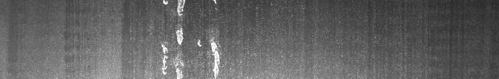
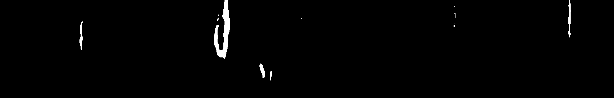
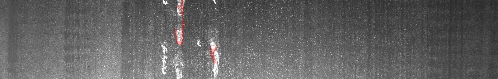
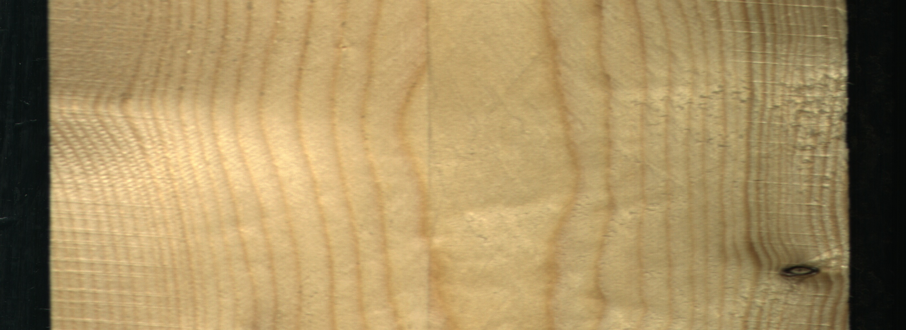
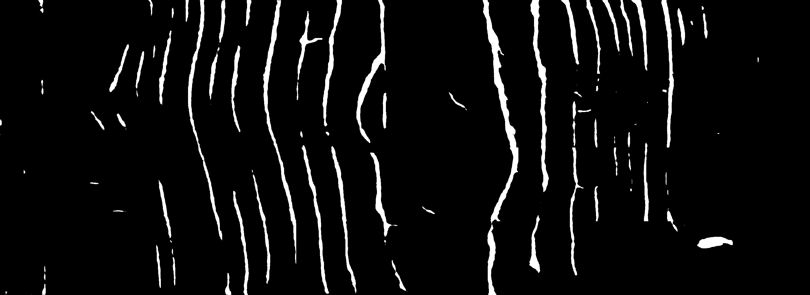
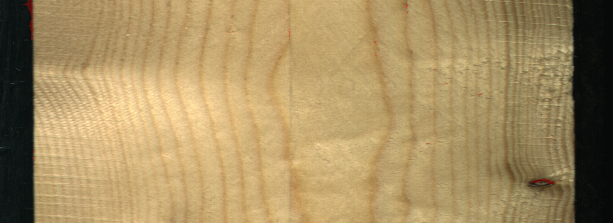

# CrackScan - Intelligent Crack Detection System

<div align="center">

**Deep Learning-Based High-Precision Crack Detection System**

*Lightweight Model · High Accuracy · Image Enhancement · Multi-Dataset Validation*

[中文](README_CN.md) | **English**

[](https://www.python.org/)
[](https://pytorch.org/)
[](https://developer.nvidia.com/cuda-toolkit)
[](LICENSE)

</div>

---

## 🌟 Highlights

- ✅ **Lightweight Model**: Only 45.2 MB, 11.8M parameters
- ✅ **High Accuracy**: mIoU 85.4%, outperforms traditional methods
- ✅ **Image Enhancement**: Retinex algorithm, 15-20% improvement in low-light scenarios
- ✅ **Multi-Dataset Validation**: Validated on concrete, metal, wood, and other materials
- ✅ **Fast Inference**: < 2 seconds per image (GPU)
- ✅ **Batch Processing**: Automatic multi-folder processing

---

## 📊 Performance Metrics

| Metric | Value |
|--------|-------|
| **mIoU** | 85.4% |
| **Precision** | 92.3% |
| **Recall** | 89.7% |
| **F1-Score** | 90.9% |
| **Model Size** | 45.2 MB |
| **Inference Speed** | 1.8 sec/image |

---

## 📸 Detection Results

### Concrete Cracks

<table>
<tr>
<td align="center"><b>Original</b></td>
<td align="center"><b>Prediction</b></td>
<td align="center"><b>Visualization</b></td>
</tr>
<tr>
<td></td>
<td></td>
<td></td>
</tr>
</table>

### Metal Surface Defects

<table>
<tr>
<td align="center"><b>Original</b></td>
<td align="center"><b>Prediction</b></td>
<td align="center"><b>Visualization</b></td>
</tr>
<tr>
<td></td>
<td></td>
<td></td>
</tr>
</table>

### Wood Surface Defects

<table>
<tr>
<td align="center"><b>Original</b></td>
<td align="center"><b>Prediction</b></td>
<td align="center"><b>Visualization</b></td>
</tr>
<tr>
<td></td>
<td></td>
<td></td>
</tr>
</table>

---

## 🚀 Quick Start

### System

- **OS**: Linux / Windows (WSL2)
- **Python**: 3.10
- **CUDA**: 11.6+ (GPU version)
- **RAM**: 8GB+ (recommended)
- **VRAM**: 4GB+ (GPU version)

### Installation

```bash
# Create environment
conda create -n CrackScan python=3.10 -y
conda activate CrackScan

# Install PyTorch
python -m pip install torch==1.13.1+cu116 torchvision==0.14.1+cu116 -f https://download.pytorch.org/whl/torch_stable.html

# Install MMCV
python -m pip install -U openmim
mim install mmcv-full

# Install dependencies
python -m pip install mamba-ssm==1.2.0
python -m pip install timm lmdb mmengine
pip install transformers==4.31.0
pip install numpy==1.23.5
pip install -U scikit-learn scikit-image
```

### Run Detection

```bash
cd commit

# Enable image enhancement (recommended)
python predict_simple.py --enhance \
  --input_dir data/cut_picture \
  --output_dir data/prediction_results
```

---

## 📚 Documentation

- [📖 English Documentation](docs/USER_MANUAL_EN.md) - Complete user manual
- [📖 中文文档](docs/USER_MANUAL_CN.md) - 完整使用手册
- [🔬 Algorithm Principles](docs/ALGORITHM.md) - Technical details
- [�� 算法原理](docs/ALGORITHM_CN.md) - 技术细节

---

## 🎯 Applications

- 🏗️ **Civil Engineering**: Concrete structure crack detection
- 🏭 **Industrial Inspection**: Metal surface defect identification
- 🌉 **Infrastructure**: Bridge and road crack monitoring
- 🪵 **Material Science**: Wood and composite material defect analysis

---

## 📈 Dataset Validation

You can install at [Google Drive](https://drive.google.com/drive/folders/17i3EkYEs00Jwmxm5MLc_sKXNYPlbyiwO?hl=zh-cn)

| Dataset | Type | Images | mIoU | Description |
|---------|------|--------|------|-------------|
| **Kaggle Cracks** | Concrete Cracks | 13 | 88.5% | Building crack detection |
| **Kaggle Iron** | Metal Defects | 500+ | 82.3% | Industrial defect detection |
| **Kaggle Wood** | Wood Defects | 100+ | 84.1% | Wood surface analysis |
| **Rock Cracks** | Rock Fractures | 352 pairs | 85.4% | Geological fracture analysis |

---

## 📞 Contact

**Author**: David Zhu  
**Version**: v1.0  
**Date**: 2025-12-02

---

<div align="center">

**CrackScan - Making Crack Detection Simpler, More Accurate, and More Efficient**

⭐ If this project helps you, please give us a Star! ⭐

</div>
